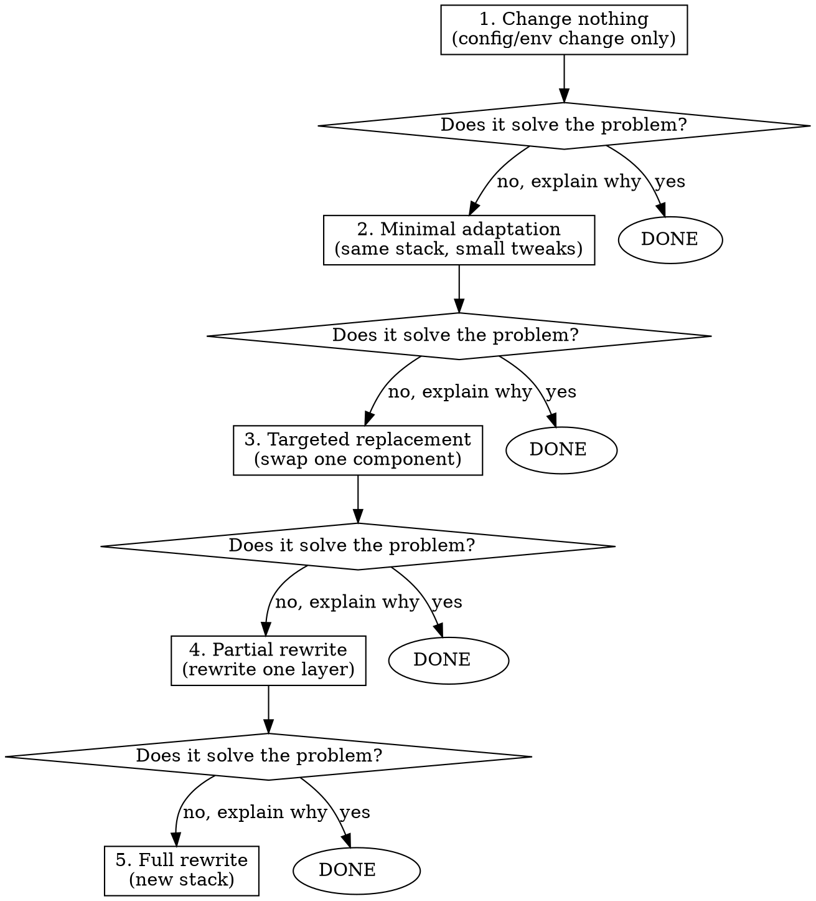

# Simplest Path

## Core Principle

**Start with what already works. Only add complexity when the simple option is proven insufficient.**

When facing a technical decision, your first instinct will be to propose the "proper" or "modern" solution. Resist this. The best solution is the one that changes the least while solving the actual problem.

## The Ladder

Work through these levels in order. Stop at the first one that works.

**You must explain why each simpler level doesn't work before moving to the next.** If you can't articulate a concrete reason, you're at the right level.

## How to Apply

When the user asks to migrate, integrate, set up, or change anything:

1. **Inventory what exists.** Read the current setup before proposing anything.
2. **Ask: can the existing thing just run somewhere else?** Docker containers, existing configs, current code. If yes, stop there.
3. **Ask: what's the minimum change to make it work?** A config file swap? An env var? A single adapter?
4. **Only propose a rewrite if levels 1-3 are concretely blocked.** Not theoretically suboptimal. Concretely blocked.

## Red Flags - You're Overcomplicating

- Proposing to rewrite working code in a different language
- Suggesting a new database when the current one works
- Recommending "the platform-native way" over "the way that already works"
- Using words like "proper", "modern", "future-proof", "best practice"
- Presenting a multi-step migration plan before checking if a one-step option exists
- Offering 3+ approaches when the user asked for one thing

**If you catch yourself doing any of these, stop. Go back to level 1 of the ladder.**

## Rationalization Table

| Excuse | Reality |
|--------|---------|
| "This is how you do it on [platform]" | The platform supports your existing approach too. Check first. |
| "It's better to do it properly" | "Properly" = working, simple, maintainable. Not "rewritten from scratch". |
| "We should future-proof this" | You don't know the future. Solve today's problem today. |
| "The current approach won't scale" | Is scaling a problem right now? If not, it's not a problem. |
| "This is a good opportunity to modernize" | The user asked for a migration, not a modernization. |
| "Long-term this will be simpler" | A rewrite that takes weeks is not simpler than a config change that takes minutes. |
| "The existing tech is outdated" | Outdated and working beats modern and unbuilt. |

## What This Skill Is NOT

This is not "never rewrite anything." Sometimes a rewrite is genuinely the simplest path (e.g., a 50-line script that's easier to rewrite than debug). The point is: **prove the simple options don't work before jumping to complex ones.**
